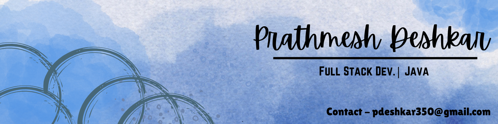

### Full Stack Developer · Security Enthusiast · Published Researcher

---

## 👋 About Me

I'm a Full Stack Developer and IT undergraduate at Madhav Institute of Technology and Science, passionate about building secure, scalable, and user-focused applications. I enjoy working across the stack, from designing responsive frontends to developing efficient backend systems and databases that power real-world solutions.

My interests lie at the intersection of software engineering, cybersecurity, and practical deployment, where I focus on creating systems that are not only functional, but also reliable, maintainable, and built with security in mind. I’m constantly exploring new technologies, improving my development workflow, and building projects that solve meaningful problems.

- 🔐 Built **Sentra** — a production-deployed encrypted file-sharing platform with AES-256-GCM, JWT auth, and dual web + desktop delivery
- 📄 **Published researcher** — AES encryption paper in IJSRD (Vol. 12, Issue 4)
- ☁️ Experienced with **cloud deployment** (Render, AWS), **Docker**, and **CI/CD via GitHub Actions**
- 🎯 Currently focused on: **Spring Boot**, system design, and leveling up backend architecture

> *Always building something. Always learning something harder.*

---

## 🛠️ Tech Stack

### Languages & Frontend

### Backend & Database

### Security & Crypto

### DevOps & Tools

---

## 🚀 Featured Projects

<table>
<tr>
<td width="50%" valign="top">

### 🔐 Sentra — Encrypted File Sharing

Full-stack encrypted file-sharing platform built for real-world use.

**Highlights:**
- AES-256-GCM encryption + RSA key wrapping
- JWT auth · HttpOnly cookies · refresh token lifecycle
- MongoDB Atlas + GridFS for encrypted storage
- Inbox/outbox with file expiry & self-destruct
- Dual release: **web** (Vite + Tailwind) + **Windows desktop** (Electron) with auto-update

`Java 21` `React` `TypeScript` `MongoDB` `Docker` `Render` `Electron`

</td>
<td width="50%" valign="top">

### 🔬 Enhanced AES-192 Research Tool

Encryption tool built on top of published cryptographic research.

**Highlights:**
- Modified AES-192 with increased MixColumns rounds
- Evaluated via entropy, avalanche effect & execution time
- Results published in **IJSRD Vol. 12, Issue 4**
- Demonstrated measurable security improvements

`Java` `AES-192` `Cryptography` `Research`

</td>
</tr>
<tr>
<td width="50%" valign="top">

### 🤖 Auto-Login Bot

Python + Selenium automation bot for credential-based auto-login workflows.

**Highlights:**
- Stealth browser automation
- Secure credential handling
- Modular and easy to extend

`Python` `Selenium` `Automation`

</td>
<td width="50%" valign="top">

### 📄 More Coming Soon

Currently working on new projects involving Spring Boot and system design.

Follow the repo to stay updated.

</td>
</tr>
</table>

---

## 📝 Research & Publications

| Paper | Journal | Year |
|-------|---------|------|
| [Assessing the Impact of Increased MixColumns on AES Encryption Security and Performance](https://www.ijsrd.com/Article.php?manuscript=IJSRDV12I40064) | IJSRD — Vol. 12, Issue 4 | 2023 |

---

## 🏆 Certifications

| Certification | Issuer | Year |
|--------------|--------|------|
| Solutions Architecture Virtual Simulation | AWS (Forage) | 2025 |
| Software Engineering Virtual Simulation | Walmart (Forage) | 2025 |
| Ethical Hacking | IIT Jodhpur | 2022 |

---

## 🎓 Education

| Degree | Institution | Year | CGPA |
|--------|-------------|------|------|
| B.Tech – Information Technology | Madhav Institute of Technology and Science, Gwalior | 2023–2027 | 7.71 / 10 (as of 5th sem) |
| Diploma – Computer Science | Government Polytechnic College, Betul | 2021–2024 | 8.09 / 10 |
| SSC (10th) | — | 2021 | 8.7 / 10 |

---

## 📬 Let's Connect

If you're a **recruiter, collaborator, or fellow developer** — feel free to reach out.

---
